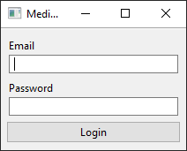
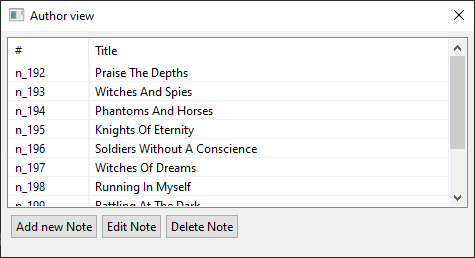
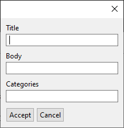

# UIs » TP Integrador » Octubre 2020

Utilizando el [dominio](https://github.com/unq-ui/2020s1.i1-medium)
provisto por la cátedra construir una aplicación similar a la plataforma
[Medium](https://medium.com/). El trabajo debe constar de una aplicación
desktop, una API y una aplicación Web.

## Forma de Trabajo y Entrega

Deben generar un repositorio público o privado en [github](https://github.com)
(si es privado debe agregar a los docentes) en donde vaya generando todas las
aplicaciones.

Debe generar un release con la entrega, **por lo menos 2 días antes** de la fecha de integrador
y enviar el link por mail a la lista de docentes de la materia.

El día de integrador deberá hacer una presentación de sus aplicaciones mediante video-llamada,
mostrando cómo funcionan las interfaces y si lo desea, el código generado.

## Parte 1: Interfaz Desktop con Arena

Se debe realizar una aplicación de escritorio utilizando
[Arena Framework](http://arena.uqbar-project.org/).
Se debe armar un **ABM de Notas** en donde el usuario (`Author`) se debe poder
_loguear_ **(no hace falta registrarse)** y crear, modificar y eliminar sus notas.

> Para poder _loguearse_ se pueden agregar los usuarios al `MediumSystem`
> de forma _hardcodeada_ en el código, utilizando la función `registerAuthor`.
> Ejemplo:
>
> ```kotlin
> val system = MediumSystem()
> system.registerAuthor("Jon Snow", "jon@snow.com", "ghost", "https://bit.ly/3496Vje")
> ```

### Ejemplos de Ventanas

> Las siguientes ventanas son a modo de ejemplo para que se comprenda la funcionalidad.
> El alumno tiene total libertad de diseño siempre y cuando se mantenga la funcionalidad.

#### Login



#### Vista del autor



#### Agregar y editar una nota

> Cuando se edita una nota se deben que cargar los datos previos.
> **IMPORTANTE**: Las categorías se cargan como un string separado por coma. Ejemplo: `"arena,kotlin,java"`



#### Confirmación al eliminar Nota


#### Opcional

* Agregar un buscador de notas en la ventan de vista del autor.
* Hacer el registro de usuarios.

## Parte 2: API

Se debe generar una API REST utilizando [Javalin](https://javalin.io/).

Se requiere una API con _header_ de autenticación en algunos _endpoints_ definidos debajo.

### Endpoints

**`POST /register`**

* **Puede** retornar el _Token de usuario_
* **Puede** retornar la información del usuario.

Body Request

```json
{
    "name": "Edward Elric",
    "email": "edwardElric@gmail.com",
    "password": "philosopherStone",
    "photo": "https://a.wattpad.com/cover/83879595-352-k192548.jpg"
}
```

---

**`POST /login`**

* **Debe** que retornar el _Token de usuario_
* **Puede** retornar la información del usuario.

Body Request

```json
{
    "email": "edwardElric@gmail.com",
    "password": "philosopherStone",
}
```

---

**`GET /user`**

* **Require** _Token_ de Usuario.
* **Debe** retornar información del usuario.

---

**`GET /user/notes`**

* **Require** _Token_ de Usuario.
* **Debe** retornar las notas del usuario.

---

**`GET /content`**

* **Debe** retornar las últimas notas cargadas.

---

**`GET /content/:id`**

* **Debe** retornar la nota con el id

---

**`POST /content/:id`**

* **Require** _Token_ de Usuario.
* **Debe** agregar un comentario a la nota.

Body Request

```json
{
    "body": "Soy un comentario",
}
```

---

**`GET /search?text=texto a buscar`**

* **Debe** realizar una búsqueda por título a partir del valor del _query param_ `text`.
* **Debe** retorna una lista de las notas que coincidan con la búsqueda.

---

**`GET /category/:name`**

* **Debe** realizar una búsqueda de notas por categoría
* **Debe** retorna una lista de las notas según la categoría.

## Parte 3: WEB

En la aplicacion web se requiere que:

* En la pagina principal del sitio se vean un resumen de las últimas notas cargadas
  (el título, quién lo escribió, las categorías que tienen y una acción para poder entrar a la nota).
* Que se pueda _cliquear_ en la categoría y traiga las notas con esa categoría.
* Que se pueda buscar notas desde cualquier lugar del sitio.
* Que al entrar una nota se vean el título, quien lo escribió, las categorías,
  el cuerpo de la nota y los comentarios de la nota.
* Que se puedan registrar y _loguear_ en cualquier lugar del sitio.
* Si un usuario se encuentra _logueado_ poder ver su perfil, este tiene que contar con sus notas.
* Si estoy en una nota y estoy _logueado_ tengo que poder dejar un comentario.
